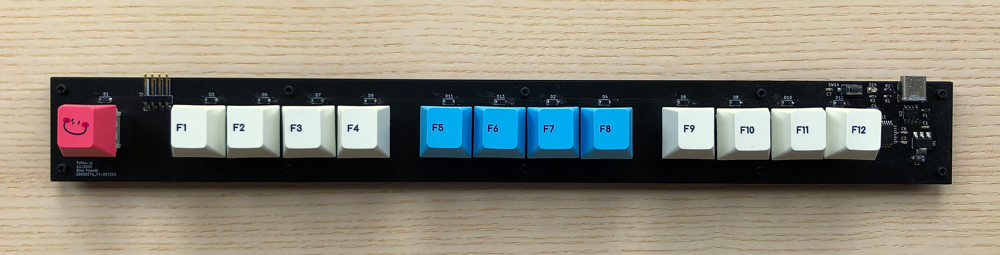

# FnRow

FnRow is a mechanical keyboard which features a single row of switches, in the form of a "function row". Each switch is configurable and can be programmed to perform as any key on a typical keyboard, or even combinations of key presses. FnRow is akin to a "macropad", but instead of having a square or rectangular "pad", the switches are stretched out in a single row.

# License

FnRow by Dino Fizzotti is licensed under Attribution-ShareAlike 4.0 International 

